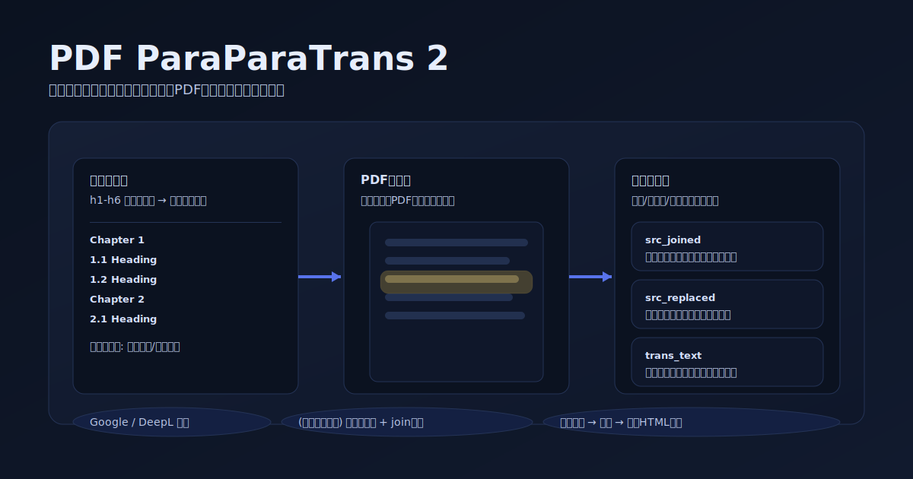
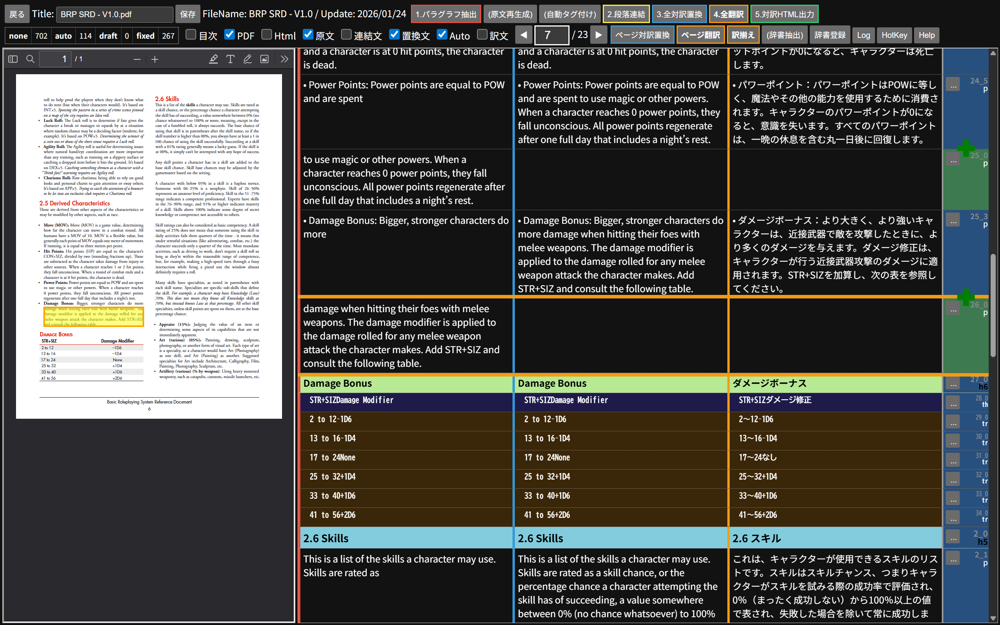

# PDF ParaParaTrans 2




**英文PDFを、段落単位で“読みやすく・直しやすく”翻訳するためのローカルWebアプリ**です。PDFを見ながら段落を整え、原文と訳文を左右で突き合わせて推敲できます。

**こんな人におすすめ**
- ルールブック/技術文書など、長文PDFを「機械翻訳→推敲」まで一気に回したい
- 変換結果の段落順が崩れていて、コピペ翻訳だと破綻する
- 固有名詞/用語を自分の辞書で固定しながら翻訳したい

**まず最初に知っておくこと（大事）**
- このアプリは **あなたのPC上（ローカル）** で動きます。
- ただし翻訳は、選んだ翻訳サービス（Google / DeepL）へ **文章が送信** されます（PDFそのものを送るわけではありません）。
- 翻訳APIは有料枠があるため、使いすぎると費用が発生する場合があります。

**まずは3分で試す（最短導線）**
1. 翻訳サービスを1つ選ぶ（迷ったらまずはGoogle）
    - [Google 翻訳 API（APIキー方式）](SETUP_GOOGLE_TRANSLATE.md)
    - [DeepL API](SETUP_DEEPL.md)
2. このアプリをPCに用意する（おすすめ: zipでダウンロード）
    - 下の「ローカル環境（おすすめ）」へ
3. 起動したらブラウザで `http://localhost:5077/` を開く
4. PDF名をクリック → **1.パラグラフ抽出**
    - 見出し/ヘッダ/フッタを整えたい → **(自動タグ付け)**
    - 改行で段落が細切れ → **2.段落連結**
    - 用語を固定したい → **3.全対訳置換**（`data/dict.txt`）
    - 最後に → **4.全翻訳**

**できること（要点）**
- Google 翻訳 API / DeepL API に対応
- PDFと抽出段落を同一画面で並べ、選択段落がPDF上でハイライト（段落の並び替えを高速に）
- **ヘッダ/フッタ** はページ上下の位置から自動判定、**見出し** はフォント名/サイズと出現傾向から推定してタグ付け（目次パネルで章へジャンプ）
- 「行頭が英小文字」などの特徴から **段落の続きを自動判定** し、翻訳前に段落を連結できる
- 同じスタイルの段落を一括でタグ変更（見出しの微調整が速い）
- 対訳辞書で“翻訳前に置換”して用語揺れを抑制（ゲーム用語などに強い）
- 段落ごとに翻訳ステータス管理（未翻訳/自動翻訳/下訳/確定）で推敲が進めやすい
- （上級者向け）Google 翻訳 API v3 で Glossary を使った翻訳も可能

## 必要環境

- Windows / macOS / Linux のPC
- Python 3.x（分からなければWindowsはMicrosoft Store版でOK）
- 翻訳APIのキー（Google / DeepL のどちらか）
- 翻訳したいPDF（`data` フォルダに入れます）

<details>
<summary>表示項目（列）とステータス（詳細）</summary>

    | No | 項目 | 概要 |
    | - | ------ | - |
    | 1 | HTML | 原文のStyleをタグで持つ文字列 |
    | 2 | 原文 | 英文テキスト |
    | 3 | 置換文 | 対訳辞書で置換したテキスト。 このテキストが翻訳APIの対象です。|
    | 4 | Auto | 置換文を翻訳APIで翻訳したテキスト |
    | 5 | 訳文 | 初期値はAutoと同じです。自動翻訳をかけても変更されない、翻訳を確定させるための列です |

- パラグラフごとに自動翻訳の対象とするかどうかと、翻訳の進捗状況を保存することができます。
    | ステータス | 自動翻訳 | 概要 |
    | ------ | - | - |
    | 未翻訳 | 対象 | 自動翻訳されていない初期状態です |
    | 自動翻訳 | 対象 | 自動翻訳後に未翻訳から自動翻訳に変わります |
    | 下訳 | 対象外 | 推敲中のパラグラフに使用します。|
    | 確定 | 対象外 | 翻訳を確定したパラグラフに使用します。 |

</details>

## セットアップ 🛠

> **どっちで動かす？（おすすめ）**
> - PCに入れて使う → このまま下の「ローカル環境」へ
> - **PCに何も入れたくない** / ブラウザだけで使いたい → 下の「GitHub Codespaces」へ

### ローカル環境（おすすめ / GitHubの知識は不要）

> **ここでやること**
> 1) zipをダウンロードして展開 → 2) 翻訳キーを設定 → 3) 起動

1. 配布ページを開いてzipをダウンロード
    - https://github.com/runequest77/pdf-paraparatrans2/releases
    - **Source code (zip)** をクリックして保存
2. zipを右クリックして「すべて展開」し、展開したフォルダを開く
3. そのフォルダでターミナルを開く
    - Windows: エクスプローラーでフォルダを表示 → 何もない所で **Shift + 右クリック** → **ターミナルで開く**
4. Pythonが入っているか確認（入っていない/動かない場合はインストール）
    - Windows 11は、開いているターミナルで `python` と入力してEnter → Microsoft Storeが開いたら「入手」でインストールできます
5. 必要なパッケージをインストール
    ```
    pip install -r requirements.txt
    ```
6. 翻訳APIキーを設定（最初はここだけ頑張ればOK）
    - `.env_sample` を `.env` にコピー
        - PowerShell:
            ```
            Copy-Item .env_sample .env
            ```
        - macOS / Linux:
            ```
            cp .env_sample .env
            ```
    - `.env` をメモ帳等で開き、使う翻訳サービスの設定だけを入れる
        - Google（APIキー方式）: `TRANSLATOR=google` と `GOOGLE_API_KEY=...`
        - DeepL: `TRANSLATOR=deepl` と `DEEPL_AUTH_KEY=...`
    - 詳細手順はそれぞれのセットアップ手順を参照
        - [SETUP_GOOGLE_TRANSLATE.md](SETUP_GOOGLE_TRANSLATE.md)
        - [SETUP_DEEPL.md](SETUP_DEEPL.md)
7. `data` フォルダを作成し、翻訳したいPDFを入れる（ドラッグ＆ドロップでOK）
8. 起動する
    ```
    python pdf-paraparatrans.py
    ```
9. ブラウザで `http://localhost:5077/` を開く（PDF一覧が出ます）

> ### macOS の場合
> コマンドが `python3` / `pip3` の場合があります。

### GitHub Codespaces（ローカルに入れたくない人向け / ブラウザだけでOK）

> **注意**
> - Codespaces はGitHub側で **支払い情報（クレジットカード等）の登録が必要** な場合があります。
> - 個人アカウントには無償枠が付くことがありますが、超過すると課金される場合があります（最新条件はGitHub側の案内を参照）。
> - 使い方が掴めたら、コストと速度の面で **ローカル環境での運用がおすすめ** です。

1. GitHubのリポジトリ画面で **Code** → **Codespaces** → **Create codespace** を選択
2. Codespaces が起動したら、下のターミナルで依存関係をインストール
    ```
    pip install -r requirements.txt
    ```
3. （推奨）GitHub 側で **Codespaces Secrets（User secrets）** を登録（コードやファイルにキーを書かない）
    1. GitHub 画面右上の **自分のアイコン** → **Settings**
    2. 左メニューの **Codespaces** → **Secrets**
    3. **New secret** を押して、以下を必要な分だけ登録
        - `TRANSLATOR`（`google` または `deepl`）
        - `GOOGLE_API_KEY`（Google APIキー方式を使う場合）
        - `DEEPL_AUTH_KEY`（DeepL を使う場合）
    4. （表示される場合）**Repository access** で、このリポジトリに使えるよう許可
    5. 反映されない場合は Codespace を **再起動**（または Rebuild）
4. `data` フォルダを作成し、変換したいPDFをアップロードして入れる
    - VS Code（Web）のファイルツリーに `data` が無ければ作成
    - PDFはドラッグ＆ドロップでアップロードできます
5. ターミナルで起動する
    ```
    python pdf-paraparatrans.py
    ```
6. ターミナルに表示されたリンク `http://localhost:5077/` を開く(Ctrl+クリックでOK)
    - 起動後に **Ports**（ポート）に 5077 が表示されたら、そこから **Open in Browser** で開けます
    - もし開けない場合は、Portsで 5077 を **Public** にする必要がある場合があります（組織設定によります）

## 使い方
### 翻訳APIの準備
 [Google 翻訳 API（APIキー方式）のセットアップ / `GOOGLE_API_KEY` の取得](SETUP_GOOGLE_TRANSLATE.md)

 [Google 翻訳 API v3（上級者向け / Glossary） のセットアップ](SETUP_GOOGLE_TRANSLATE_V3.md)

 [DeepL API のセットアップ / `DEEPL_AUTH_KEY` の取得](SETUP_DEEPL.md)

どれを選べばいいか迷ったら、まずは **Google（APIキー方式）** がおすすめです。

### 🔠 置換辞書の準備
`data\dict.txt` に翻訳前に置換したい単語を登録します。タブ区切りテキストファイルです。

起動時に存在しない場合、サンプルが作成されます。

```
#英語	#日本語	#状態	#出現回数
Blaadesharp|《鋭刃》|0|3
Beffadle|《惑い》|0|2
```
> 3列目がステータスです。
> 0の場合、大文字小文字を区別せずに置換します。3列目のない辞書データは0として扱われます。
> 1の場合、大文字小文字が一致する場合のみ置換します。
> ステータスは2以上の行は対訳辞書の自動生成で使用します。ユーザーがステータスを0か1にするまで無視されます。
> 
> 4列目が抽出をかけた文書での単語の登場回数です。これは文書を切り替えて抽出を行うたびに再計算されます。

### 🅿️ PDF一覧画面
`data`フォルダにいれたPDFが一覧表示されます。PDF名をクリックすると、そのPDF用の画面に移動します。
### 📖 メイン画面

| No | 機能 | 概要 |
| - | - | - |
| - | 保存 | 文書のタイトルを変更して保存します。文書構造なども同時に保存されます。 |
| 1 | パラグラフ抽出 | PDFを`data`フォルダに居れた後、**最初に `1.パラグラフ抽出` をクリック**します。<br>OKを押すと、少し待ち時間があった後にパラグラフが表示されます。 |
| - | (自動タグ付け) | 見出しを推定して `block_tag`（h1〜h6等）をセットします。<br>あわせて段落連結候補（`join`）も自動でセットします。 |
| 2 | 段落連結 | +マーカーをつけた段落の`原文`を同じタグの前段落の`結合文`へ連結します（結合→置換→翻訳の手順です）。<br>`結合文` や`置換文` も初期化されます。<br>ステータスが自動翻訳以下の場合は`訳文`もリセットされます。|
| 3 | 全対訳置換 | 対訳辞書 `data/dict.txt` に従って`結合文`を置換して`置換文`にセットします。 |
| 4 | 全翻訳 | 文書の全ページに対して自動翻訳を実行します。 |
| 5 | 対訳ファイル出力 | dataフォルダに **`訳文`** と **`原文`** が横並びになったhtmlファイルを出力します。 <br>header/footerは翻訳/対訳htmlへの出力から除外されます。|
| - | 目次パネル | h1～h6のパラグラフを階層表示し、クリックで当該パラグラフへ移動します。<br>ページ/原文/訳文の表示やパネル表示/非表示を切り替えられます。 |
| - | PDF | PDFの現在のページを表示します。<br>チェックボックスで表示/非表示を切り替えられます。 |
| - | ページ対訳置換 | 現在のページに対して対訳置換を実行します。|
| - | ページ翻訳 | 現在のページに対して自動翻訳を実行します。|
| - | (辞書抽出) | 現在の文書から固有名詞と解釈しうる文字列を対訳辞書 `data/dict.txt` に「ステータス9（未翻訳）」で追加します。<br>すでに対訳辞書にある文字列やステータスは維持されます。 |
| - | 辞書登録 | 対訳辞書に単語を登録できます。 |

#### パラグラフ
- パラグラフは左端をつかんでドラッグすることで順序が入れ替えられますが、`ショートカットキー` での入れ替えが快適です。
1. パラグラフ右のボタン [...] をクリックすると `✍️ 編集画面` が開きます。
2. [自動翻訳]をクリックすると、そのパラグラフだけを翻訳できます。
3. [種別]をh1～h6に変更すると、対訳ファイルのパラグラフがそのタグで囲まれます。
4. **[原文]** もしくは **[訳文]** の項目は編集できます。<br>パラグラフ右の [保存] ボタンで内容が保存され、編集画面が閉じます。
5. ステータス
    - `未翻訳` のパラグラフが「全翻訳」「ページ翻訳」の対象になります。
    - `自動翻訳` のパラグラフは 対訳辞書の変更によって置換文が変わる場合、「対訳置換」を行うと`未翻訳`に戻ります。
    - `下訳`、`確定` のパラグラフは「対訳置換」で置換文は変更されますが、ステータスは変わりません。

### ショートカットキー
右上の **HotKey** ボタンからも一覧表示できます。

#### 移動・選択
| **キー** | **動作** |
|----------|---------|
| **↑ / ↓** | カレントパラグラフを移動 |
| **Shift + ↑ / ↓** | 選択範囲を伸ばしながら移動 |
| **Esc** | 選択解除 |

#### 見出しナビゲーション
| **キー** | **動作** |
|----------|---------|
| **Ctrl + ↑ / ↓** | 前/次の見出しへ移動 |
| **Ctrl + Shift + ↑ / ↓** | 前/次の見出しまで選択 |

#### ページ移動
| **キー** | **動作** |
|----------|---------|
| **← / →** | 前/次のページ |
| **Ctrl + ← / →** | 前/次のページ（同等） |
| **Ctrl + Shift + ← / →** | 前/次のページ（同等） |

#### タグ（段落種別）
| **キー** | **動作** |
|----------|---------|
| **Alt + 0..9** | `p/h1..h6/header/footer/remove` をセット |
| **Alt + L** | `li` をセット |
| **Alt + T** | `tr` をセット |
| **Alt + H** | `th` をセット |

#### グループ・結合
| **キー** | **動作** |
|----------|---------|
| **Alt + .** | グループ化/解除 |
| **Alt + +** / **Alt + ;** | 段落結合フラグ（`join`）のON/OFF |
| **Ctrl + Alt + +** | `2.段落連結` を実行 |

#### 翻訳・辞書
| **キー** | **動作** |
|----------|---------|
| **Alt + /** | 選択（カレント）パラグラフを翻訳 |
| **Ctrl + Alt + /** | ページ翻訳 |
| **Alt + C** | 翻訳クリア |
| **Alt + J** | 対訳辞書登録 |

#### ステータス
| **キー** | **動作** |
|----------|---------|
| **Alt + N / A / D / F** | `none / auto / draft / fixed` をセット |

#### 並べ替え・保存・編集
| **キー** | **動作** |
|----------|---------|
| **Alt + ↑ / ↓** | 選択範囲を上下へ移動 |
| **Ctrl + Alt + ↑ / ↓** | 選択範囲を次の見出しへ移動 |
| **Ctrl + S** | 構造保存 |
| **F2** | 編集UI切り替え |
| **PageUp / PageDown** | srcパネルを1画面スクロール（環境によっては `RollUp/RollDown`） |

## パラグラフ自動解析について
パラグラフがどれぐらいきれいにまとまるかは、PDFの作りによります。<br>
同一パラグラフが改行されるときに後ろにスペースがつくタイプのPDFはかなり綺麗にまとまっています。<br>
つくりの悪いPDFに対する対処も検討していますが、いまのところ悪影響の方が多いので実装していません。<br>
要望が多いようであればもう少し他の機能を煮詰めてから検討してみます。

## 今後の予定とか

下記のようなことを思いついていますが、みなさんの要望やアイデアがあれば対応できるものからやっていきますので、気軽にお声がけ下さい。<br>
プルリクも歓迎します。
### 機能
- **ルーンフォント**など特殊フォントを指定できる辞書ファイル形式
- `文書の構造情報`だけをエクスポート/インポートして同じPDFを持っている人に提供できる機能
- 自動翻訳に送らないパターンの精査と送信前の予測文字数/削減文字数の通知
- 文書内で同一内容のパラグラフは1パラグラフだけ自動翻訳
- 文書解析時などの待ち時間をユーザーに通知
- PDFを1ページ表示ではなく複数ページ表示
- 使い方のコツの説明動画
- 技術解説記事

## 更新履歴
- v2.0.0: 2026/01/22 全機能を刷新。ver2以前とのデータ互換はありません。

## 🙏 寄付のお願い
**PDF ParaParaTrans** はフリーウェアですが、翻訳APIを使用したテストを繰り返すため、50万字の無料枠を超過して困っています。

なるべく自分に必要な文書をテストを兼ねて実行するようにはしていますが、ロジックの改善は一定量以上の同じ文書を繰り返し送る必要があるので、すぐに5万字、10万字とカウントが上がってしまいます。

よろしければ **runequest77@gmail.com** 宛てに **[amazonギフト券](https://www.amazon.co.jp/b?node=2351652051)** をお送りいただけますと、費用の不安が減って私の心が安らぎます。

## 連絡先
[X(twitter) @nayuta77](https://x.com/nayuta77)
