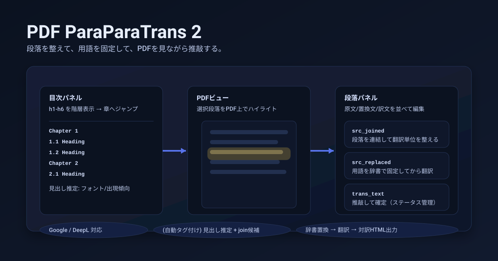
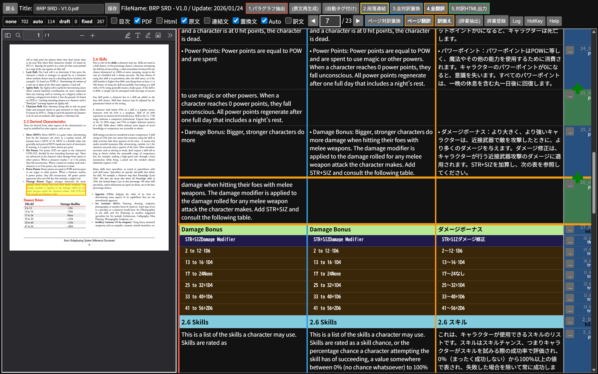

# PDF ParaParaTrans 2





PDF ParaParaTrans 2 は、英語の PDF や Web ページを、段落ごとに読みやすく翻訳して整えていくためのアプリです。

ブラウザで使えるので、原文を見ながら訳文を少しずつ直していけます。

長い文書を「まとめて機械翻訳して終わり」ではなく、「読みながら整える」使い方に向いています。

## 1. アプリの概要

このアプリは、次のような方に向いています。

- ルールブックやマニュアルなど、長い PDF を少しずつ翻訳したい方
- 自動翻訳だけでは不安なので、原文を見ながら手直ししたい方
- 用語のゆれを減らしながら訳したい方
- PDF だけでなく、Web ページも同じ感覚で整理したい方

アプリ本体はあなたの PC で動きます。

ただし、Google 翻訳や DeepL を選んだ場合は、翻訳する文章がそのサービスに送られます。外部に送信したくない場合は、Ollama を使う方法があります。

## 2. できること

このアプリでできることは次のとおりです。

- PDF を取り込み、段落ごとに分けて表示する
- 原文と訳文を並べて確認する
- 段落ごとに自動翻訳し、必要な場所だけ手で直す
- よく出る用語を辞書でそろえる
- 見出しを目次のようにたどりながら読む
- 翻訳結果を Markdown やテキストで書き出す
- PDF だけでなく、Web ページを取り込んで整理する

## 3. インストール

あなたの使い方に合わせて、次の方法から選んでください。

### 方法 A: Windows の exe 版を使う

いちばん手軽です。Python の準備は不要です。

1. Releases ページを開きます。  
   https://github.com/runequest77/pdf-paraparatrans2/releases
2. 最新版の **Assets** から `pdf-paraparatrans.exe` をダウンロードします。
3. 作業用フォルダを作り、その中に `pdf-paraparatrans.exe` を置きます。
4. `pdf-paraparatrans.exe` をダブルクリックして起動します。
5. ブラウザで `http://localhost:5077/` を開きます。

### 方法 B: zip をダウンロードして使う

Windows / macOS / Linux で使えます。

1. Releases ページを開きます。  
   https://github.com/runequest77/pdf-paraparatrans2/releases
2. **Source code (zip)** をダウンロードします。
3. zip を展開します。
4. Python をインストールします。
5. 展開したフォルダでターミナルを開きます。
6. 次のコマンドを実行して、必要なものを入れます。

   ```bash
   python -m pip install -r requirements.txt
   ```

7. 初回起動時に `.env` が自動で作られます。必要に応じて、そのファイルに翻訳サービスの設定を書きます。
8. 次のコマンドで起動します。

   ```bash
   python pdf-paraparatrans.py
   ```

9. ブラウザで `http://localhost:5077/` を開きます。

> macOS や一部の環境では、`python` の代わりに `python3` を使います。

### 方法 C: ブラウザだけで試す

PC に入れたくない場合は、GitHub Codespaces を使う方法もあります。

1. リポジトリ画面を開きます。  
   https://github.com/runequest77/pdf-paraparatrans2
2. **Code** → **Codespaces** → **Create codespace** を選びます。
3. 起動後にターミナルで次のコマンドを実行します。

   ```bash
   python -m pip install -r requirements.txt
   python pdf-paraparatrans.py
   ```

4. 表示された 5077 番ポートをブラウザで開きます。

### 翻訳サービスの準備

翻訳には、次のどれか 1 つを選びます。

- Google 翻訳 API  
  [SETUP_GOOGLE_TRANSLATE.md](SETUP_GOOGLE_TRANSLATE.md)
- DeepL API  
  [SETUP_DEEPL.md](SETUP_DEEPL.md)
- Ollama（文章を外部に送りたくない方向け）  
  [SETUP_OLLAMA.md](SETUP_OLLAMA.md)

迷ったら、次の目安で選ぶと分かりやすいです。

- 安定して使いたい → Google 翻訳 API
- DeepL を使い慣れている → DeepL API
- 外部送信なしで使いたい → Ollama

## 4. クイックスタート

最短で試す手順です。

1. アプリをインストールして起動します。
2. ブラウザで `http://localhost:5077/` を開きます。
3. 右上の **「PDFを追加」** を押して PDF を取り込みます。  
   すでに `data` フォルダに PDF を入れている場合は、そのまま一覧に出ます。
4. 一覧から PDF 名をクリックします。
5. **「1.パラグラフ抽出」** を押します。
6. 必要なら **「2.段落連結」** を押して、途中で切れた段落をつなぎます。
7. 用語をそろえたい場合は **「3.全対訳置換」** を押します。
8. **「4.全翻訳」** を押します。
9. 訳文を見ながら、気になる段落だけ手で直します。

## 5. 基本的な使い方

### PDF を追加する

1. 一覧画面を開きます。
2. 右上の **「PDFを追加」** を押します。
3. 翻訳したい PDF を選びます。
4. 一覧に追加されたら、PDF 名をクリックします。

### 最初にやること

1. **「1.パラグラフ抽出」** を押します。
2. 画面に段落が並んだら、順番や区切りが大きくずれていないか確認します。
3. 途中で切れている段落が多いときは **「2.段落連結」** を押します。

### 翻訳する

1. **「4.全翻訳」** を押すと、未翻訳の段落がまとめて翻訳されます。
2. 1 ページずつ進めたい場合は、ページ単位の翻訳を使います。
3. 1 段落だけ試したい場合は、その段落だけ翻訳できます。

### 訳文を直す

1. 気になる段落の編集画面を開きます。
2. 訳文を読みやすい形に直します。
3. 必要ならコメントを残します。
4. 保存します。

### 用語をそろえる

1. よく出る単語や固有名詞を辞書に登録します。
2. **「3.全対訳置換」** を実行します。
3. 置き換え結果を見て、必要なら辞書を調整します。

### 書き出す

1. 翻訳がまとまったら、出力メニューを開きます。
2. Markdown またはテキストを選びます。
3. 保存したファイルを、共有や清書に使います。

## 6. よくある使い方

### 例 1: まず全体をざっと読みたい

1. PDF を追加します。
2. **「1.パラグラフ抽出」** を押します。
3. **「4.全翻訳」** を押します。
4. 全体を読みながら、必要なところだけ直します。

### 例 2: 用語をそろえながら丁寧に訳したい

1. 先に辞書へよく使う単語を入れます。
2. **「3.全対訳置換」** を押します。
3. **「4.全翻訳」** を押します。
4. 固有名詞や専門用語がそろっているか確認しながら直します。

### 例 3: 長い PDF を少しずつ進めたい

1. まず段落を抽出します。
2. その日見るページだけ翻訳します。
3. 直した段落を保存します。
4. 次回は続きから進めます。

### 例 4: Web ページを読みやすく整理したい

1. 一覧画面で **「URLを追加」** を押します。
2. 取り込みたいページを登録します。
3. PDF と同じように、翻訳と整理を進めます。

## 7. FAQ

### Q. 無料で使えますか？

アプリ本体は無料です。

ただし、Google 翻訳 API や DeepL API は利用量によって料金がかかることがあります。Ollama は API 利用料なしで使えます。

### Q. 文章は外部に送られますか？

Google 翻訳 API や DeepL API を使う場合は、翻訳する文章がそのサービスに送られます。

Ollama を使う場合は、基本的にあなたの PC の中だけで処理できます。

### Q. PDF ファイルそのものが送られますか？

通常は、翻訳の対象になる文章が送られます。PDF ファイルそのものをそのまま外部へ送る使い方ではありません。

### Q. どの翻訳サービスを選べばいいですか？

迷ったら Google 翻訳 API が始めやすいです。

外部に送りたくない場合は Ollama を選んでください。

### Q. 起動したのに画面が開きません。

1. ブラウザで `http://localhost:5077/` を開いてみてください。
2. うまくいかない場合は、すでに別のアプリが 5077 番を使っていないか確認してください。
3. それでも開けない場合は、`.env` の `PORT` を別の番号に変えて再起動してください。

### Q. `.env` って何ですか？

翻訳サービスの設定を書くためのファイルです。

zip 版では、初回起動時に自動で作られます。中身はテキストなので、メモ帳などで開いて設定できます。

### Q. PDF の区切りが変です。

PDF の作り方によっては、段落の切れ方がきれいにならないことがあります。

その場合は **「2.段落連結」** を使ったり、必要な段落だけ手で直したりしてください。

## 8. サポート情報

質問や相談は、次の Discord チャンネルをご利用ください。

https://discord.com/channels/1477283417967169629/1477613792090259697
